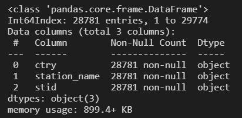
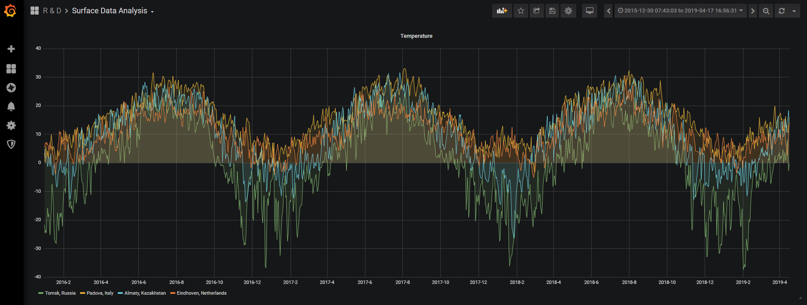

# Capstone Project - Global Surface Summary Dashboard

## 1. Scope and data

The goal of this project is to build an analytics dashboard for surface summary data
provided by NOAA. The dashboard should be easily accessible for multiple users
and allows to analyse temporal dynamics of the climate data.

The dataset used in
this project available at [Kaggle](https://www.kaggle.com/noaa/noaa-global-surface-summary-of-the-day).

## 2. Data exploration and Assessment

The dataset contains surface summary data from 1929 until 2019 from over 9000
climate stations worldwide. The daily elements included in the dataset
(as available from each station) are:

- Mean temperature
- Mean dew point
- Mean sea level pressure
- Mean station pressure
- Mean visibility
- Mean wind speed
- Maximum sustained wind speed
- Maximum wind gust
- Maximum temperature
- Minimum temperature
- Precipitation amount
- Snow depth

**Note:** For this project we focus on the temperature data (mean, max, min).

There are several prominent data quality issues in the dataset, which needs to
be handled before processing.

- missing data (station number, station measurements, station country, etc.)
- duplicate data (same station number for several stations in different countries)
- not proper units of measurements (e.g. we need to cast Fahrenheit to Celsius)

To clean this data the following steps performed:

- unique station id should be designed to overcome duplicate and missing station number and wsban data
- all stations that can't be linked to the country should be discarded
- temperature data should be converted to proper units

The more detailed process provided in the *notebooks/prepare_metadata.ipynb* and
*notebooks/dataflow-example.ipynb*.

Below a summary of metadata derived from *data/isd-history.csv*

## 3. Data model

In this project, I am working with time-series data, which required some special
treatment. To store this data efficiently it's required to use databases
specifically designed for. After doing some research, I decided to use
[InfluxDB](https://docs.influxdata.com/influxdb/v1.8/), which
is stated to be the best on the market at the moment, e.g. compared to MongoDB
it can provide:

- 3.9x better data ingestion
- 16.6x better compression
- 16% better query performance

**Note on users:** this database highly scalable and can allow an increase in
users base by 100 people.

**Note on data:** due to high compression rate of InfluxDB data can be
increased 100 times.

To design the data model, we need to address the definition of key concepts
such as fields, tags and measurements.

- **Fields** is the key-value pairs in an InfluxDB data structure that record
metadata and the actual data value. Fields are required in InfluxDB data structures
and they are not indexed - queries on field values scan all points that match the
specified time range and, as a result, **are not** performant relative to tags.

- **Tags** is the key-value pair in the InfluxDB data structure that records
metadata. Tags are an optional part of the data structure, but they are useful
for storing commonly-queried metadata; **tags are indexed** so queries on tags
are performant.

- **Measurements** is the part of the InfluxDB data structure that describes
the data stored in the associated fields. Measurements are strings.

Taking into account above-mentioned concepts our data will be organized into
InfluxDB database with the following measurement:

- measurement: temperature
    - fields: mean, max, min temperatures
    - tags: station id, country, station name

The necessary steps to pipeline data into the provided model are the following:

- read and clean .op files which contains measurement for a particular year
- transform .op files into a pandas data frame
- upload pandas data frame into influxdb measurement using influxdb python client library

**Note:** after this steps Influx DB should be connected to the Grafana instance,
following [this guide](https://grafana.com/docs/grafana/latest/features/datasources/influxdb/).

**Note:** All components were executed in Docker environment, which can be recreated
using docker compose file in *infrastrcuture/infrastructure.yaml*

## 4. Resulting Grafana dashboard

Please find an example of a developed dashboard below. I combined several years
data from several cities into set of panels into single dashboard.

## Q&A

How you would approach the problem differently under the following scenarios?

1. - If the pipelines were run daily by 7 am?
   - For this, I will incorporate some workflow management system
   (e.g. **Airflow**), that allows to schedule pipelines at a convenient time.

2. - If the data was increased by 100x?
   - Current installation of InfluxDB allows to handle 100x increase, however
   with more expansion it's preferably to move into cloud-managed version,
   with [elastic scalability support](https://www.influxdata.com/products/influxdb-cloud/).

3. - If the database needed to be accessed by 100+ people?
   - In case of growing user base it's possible to increase the amount of Grafana
   instances and [put a load balancer in front](https://grafana.com/docs/grafana/latest/administration/set-up-for-high-availability/).
   Access to the database will not be a problem for 100 users, due to speed that Influx DB can provide.
